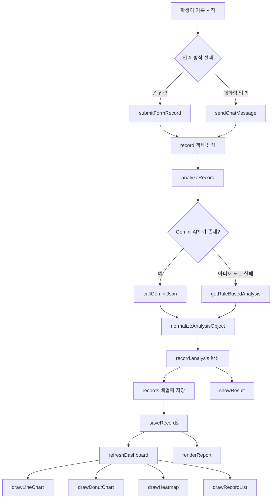
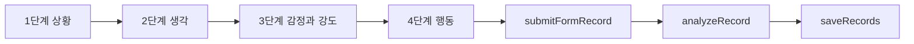
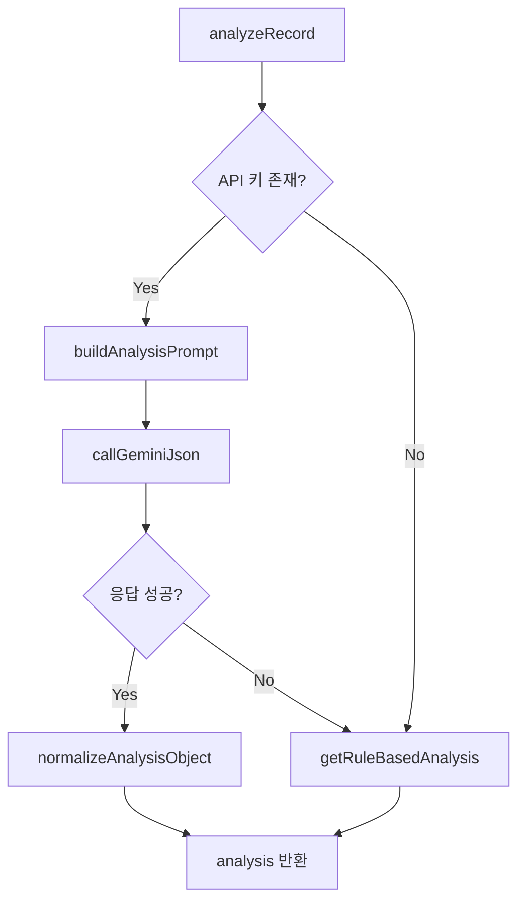
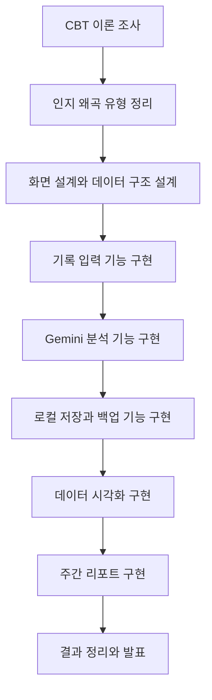

# CBT 기반 학습 불안 완화 AI 시스템 교육 문서

> [!info]
> 이 문서는 `index.html` 한 파일로 구현된 CBT 기반 학습 불안 완화 및 메타인지 강화 AI 시스템을 학생들에게 2시간씩 4회차로 교육하기 위한 옵시디언용 문서이다.  
> 목표는 `4300줄 전체 해설`이 아니라, `작품을 움직이는 핵심 기능과 개발 흐름`을 중심으로 이해시키는 것이다.

---

## 1. 프로젝트 한 줄 정의

이 작품은 학생이 **상황-생각-감정-행동**을 기록하면,  
AI 또는 로컬 규칙 엔진이 **인지 왜곡 패턴을 분석**하고,  
그 결과를 **차트와 주간 리포트**로 보여주는 CBT 기록 웹앱이다.

---

## 2. 학생들에게 먼저 설명할 핵심 개념

### 2-1. 왜 이 작품을 만드는가

- 학습 불안은 시험, 발표, 과제 같은 사건 자체보다 그 사건을 해석하는 생각에 크게 영향을 받는다.
- CBT는 사건(A), 신념/생각(B), 감정·행동(C)의 연결을 구조적으로 본다.
- 학생이 자기 생각을 기록하고 다시 해석해보는 과정 자체가 메타인지 훈련이 된다.
- 이 시스템은 그 기록 과정을 혼자 하기 어렵다는 문제를 AI와 데이터 시각화로 보조한다.

### 2-2. 최종 결과물은 무엇인가

- 폼 입력과 대화형 입력 두 방식으로 기록 가능
- Gemini API 또는 로컬 규칙 엔진으로 생각 분석
- 인지 왜곡 패턴 제시
- 다시 생각해볼 질문, 대안적 사고, 다음 행동 제안
- 누적 기록을 선 그래프, 도넛 차트, 히트맵으로 시각화
- 최근 7일 기준 주간 리포트 생성
- 로컬 저장, 백업 내보내기, 불러오기 지원

---

## 3. 스크린샷 기준 실제 프로젝트 일정 정리

스크린샷에 나온 원래 일정은 아래처럼 해석할 수 있다.

| 기간 | 원래 일정 | 교육에서 해석할 의미 |
| --- | --- | --- |
| 4월 3일 ~ 18일 | CBT 이론 및 인지 왜곡 유형 조사 | 문제 정의, 도메인 조사 |
| 4월 20일 ~ 30일 | 시스템 설계 및 화면 구성 디자인 | 화면 설계, 데이터 설계 |
| 5월 ~ 6월 15일 | 기본 기능 개발 / 생성형 AI 연동 및 데이터 수집 | 핵심 기능 구현 |
| 6월 16일 ~ 30일 | 데이터 분석 및 시각화 | 차트, 리포트, 통계 |
| 7월 | 결과 정리 및 보고서 작성 | 발표, 문서화, 검증 |

이걸 학생 교육용으로 압축하면 아래 4회차로 나누는 것이 가장 자연스럽다.

---

## 4. 4회차 교육 전체 구성

| 회차 | 시간 | 주제 | 연결되는 실제 개발 단계 |
| --- | --- | --- | --- |
| 1회차 | 2시간 | 문제 정의 + CBT 구조 + 서비스 설계 읽기 | 이론 조사, 화면 설계 |
| 2회차 | 2시간 | 기록 입력 기능과 데이터 구조 구현 원리 | 기본 기능 개발 |
| 3회차 | 2시간 | Gemini 분석 + 로컬 폴백 + 저장 구조 | AI 연동, 데이터 수집 |
| 4회차 | 2시간 | 대시보드, 주간 리포트, 백업/발표 정리 | 데이터 시각화, 결과 정리 |

---

## 5. 학생들이 꼭 봐야 하는 핵심 함수 묶음

학생들에게는 전체 파일이 아니라 아래 기능 블록만 설명하면 된다.

| 기능 블록 | 핵심 함수 | 역할 |
| --- | --- | --- |
| 초기화 | `init()`, `bindEvents()` | 앱 시작과 이벤트 연결 |
| 로컬 저장 | `loadStorage()`, `saveRecords()`, `saveSettings()`, `saveReportCache()` | 브라우저 저장소 관리 |
| 백업/복원 | `buildBackupPayload()`, `exportRecordsBackup()`, `importBackupPayload()` | JSON 내보내기/불러오기 |
| 기록 입력 | `updateFormUi()`, `getFormRecord()`, `validateCurrentStep()`, `submitFormRecord()` | 4단계 폼 기록 흐름 |
| 대화형 입력 | `initChat()`, `sendChatMessage()`, `parseEmotionMessage()` | 챗봇 방식 기록 흐름 |
| 분석 엔진 | `analyzeRecord()`, `callGeminiJson()`, `getRuleBasedAnalysis()` | Gemini 분석 또는 폴백 분석 |
| 왜곡 처리 | `rankDistortions()`, `normalizeAnalysisObject()`, `normalizeRecord()` | 분석 결과 표준화 |
| 시각화 | `refreshDashboard()`, `drawLineChart()`, `drawDonutChart()`, `drawHeatmap()`, `drawRecordList()` | 기록 데이터를 시각화 |
| 주간 리포트 | `buildWeeklyStats()`, `buildLocalWeeklyReport()`, `generateAiWeeklyReport()`, `renderReport()` | 최근 7일 요약 |

---

## 6. 코드 구조를 학생에게 설명하는 가장 쉬운 방법

### 6-1. 이 작품은 사실 5개 층으로 나뉜다

1. 화면 층  
   `hero`, `setup`, `record`, `dashboard`, `report` 섹션으로 화면을 나눈다.

2. 입력 층  
   폼 입력과 대화형 입력 두 경로로 사용자의 기록을 받는다.

3. 분석 층  
   Gemini API가 있으면 AI 분석, 없으면 로컬 규칙 분석을 수행한다.

4. 저장/가공 층  
   기록을 `localStorage`에 저장하고, 최근 7일 통계를 계산한다.

5. 출력 층  
   모달, 차트, 히트맵, 리포트로 결과를 다시 사용자에게 보여준다.

### 6-2. 실제 데이터 구조

학생들에게 가장 먼저 아래 데이터 한 건을 이해시키면 전체 구조가 잡힌다.

```json
{
  "id": 1712040000000,
  "date": "2026-04-02T06:00:00.000Z",
  "situation": "모의고사에서 마지막 문제를 틀렸다.",
  "thought": "이번에도 망했다. 나는 수학을 못한다.",
  "emotion": "불안",
  "intensity": 8,
  "behavior": "복습 대신 휴대폰만 봤다.",
  "analysis": {
    "summary": "흑백논리와 과잉일반화가 보인다.",
    "distortions": [],
    "reflectionQuestions": [],
    "alternativeThoughts": [],
    "metacognitionInsight": "",
    "nextAction": "",
    "cautionNote": "",
    "source": "gemini"
  }
}
```

이 구조 하나가 입력, 저장, 차트, 리포트의 공통 단위다.

---

## 7. 작품이 동작하는 전체 흐름도



---

## 8. 핵심 기능별 설명

## 8-1. 앱 시작: `init()`

`init()`은 이 작품의 출발점이다.

실행 순서는 아래와 같다.

1. `loadStorage()`로 기존 기록과 설정 불러오기
2. `renderDistortionCards()`로 7가지 인지 왜곡 카드 렌더링
3. `renderEmotionChips()`로 감정 버튼 렌더링
4. `applySavedSettingsToInputs()`로 저장된 Gemini 설정 반영
5. `syncModeStatus()`로 현재 분석 모드 표시
6. `updateFormUi()`로 폼 초기 상태 세팅
7. `refreshDashboard()`로 차트 초기 렌더링
8. `renderReport("local")`로 기본 주간 리포트 표시
9. `initChat()`으로 대화형 입력 초기화
10. `bindEvents()`로 버튼, 입력창, 모달 등 이벤트 연결

학생들에게는 `앱이 켜질 때 무엇을 먼저 로드하고 무엇을 나중에 그리는가`를 이 함수로 이해시키면 된다.

---

## 8-2. 기록 입력 기능

### 폼 입력 핵심 함수

- `updateFormUi()`
- `getFormRecord()`
- `validateCurrentStep()`
- `submitFormRecord()`

폼 입력은 4단계로 나뉜다.

1. 상황 입력
2. 생각 입력
3. 감정 + 강도 입력
4. 행동 입력

학생들에게 설명할 핵심은 이것이다.

- 한 번에 모든 입력을 받지 않고, 단계별로 나눠서 심리적 부담을 줄였다.
- `validateCurrentStep()`으로 각 단계가 최소 길이 조건을 만족하는지 검사한다.
- 마지막 단계에서만 `record` 객체를 만들고 분석으로 넘긴다.

### 폼 입력 흐름도



---

## 8-3. 대화형 입력 기능

### 핵심 함수

- `initChat()`
- `sendChatMessage()`
- `parseEmotionMessage()`

이 기능은 초보자가 폼보다 편하게 입력하도록 만든 것이다.

동작 원리:

1. AI가 질문을 던진다.
2. 학생이 답한다.
3. 각 답변은 `chatData`에 누적된다.
4. 감정 단계에서는 `parseEmotionMessage()`가 감정명과 숫자를 해석한다.
5. 마지막 질문이 끝나면 폼 입력과 같은 `record` 구조로 변환된다.
6. 이후 흐름은 동일하게 `analyzeRecord()`로 연결된다.

핵심 교육 포인트:

- 입력 방식은 달라도 최종 데이터 구조는 같아야 한다.
- 즉, UI가 2개여도 모델은 1개여야 유지보수가 쉽다.

---

## 8-4. 분석 엔진: Gemini + 로컬 폴백

### 핵심 함수

- `analyzeRecord()`
- `callGeminiJson()`
- `buildAnalysisPrompt()`
- `buildAnalysisSystemInstruction()`
- `getRuleBasedAnalysis()`
- `rankDistortions()`

이 작품에서 가장 중요한 설계 포인트는 `이중 분석 구조`다.

### 동작 원리

1. `analyzeRecord()`가 시작점이다.
2. API 키가 있으면 `callGeminiJson()`으로 Gemini 호출
3. 응답은 `normalizeAnalysisObject()`로 표준화
4. API 키가 없거나 실패하면 `getRuleBasedAnalysis()` 사용
5. 따라서 어떤 상황에서도 결과는 끊기지 않는다

### 왜 이 구조가 교육적으로 중요한가

- 학생들이 AI 기능을 넣을 때 `외부 API 실패`를 반드시 고려해야 함
- 완성도 높은 앱은 `AI 성공 케이스`만이 아니라 `실패 시 대체 경로`까지 설계해야 함

### 분석 엔진 흐름도



### 학생에게 꼭 강조할 점

- `buildAnalysisPrompt()`는 AI에게 어떤 결과 형식을 원하는지 명확히 지시한다.
- `responseMimeType: "application/json"` 구조를 사용해 자유로운 문장 대신 구조화된 데이터를 받는다.
- 이 덕분에 결과를 차트, 카드, 리포트에 안정적으로 연결할 수 있다.

---

## 8-5. 로컬 저장과 백업

### 핵심 함수

- `loadStorage()`
- `saveRecords()`
- `saveSettings()`
- `saveReportCache()`
- `buildBackupPayload()`
- `exportRecordsBackup()`
- `importBackupPayload()`

### 학생들에게 설명할 핵심

이 작품은 서버 DB 없이도 동작한다.

- 기록은 `localStorage`에 저장
- Gemini 모델명도 `localStorage`에 저장
- 주간 리포트 캐시도 저장
- 백업은 JSON 파일로 내보내기 가능
- 불러오면 다시 `records` 배열과 `localStorage`에 반영

### 왜 중요한가

- 작은 교육용 프로젝트에서 서버 없이도 완성형 UX를 만들 수 있다.
- 대신 `기기 변경` 문제를 해결하기 위해 파일 백업 기능이 필요하다.
- 여기서 학생들은 `저장`, `복원`, `동기화`의 차이를 배울 수 있다.

---

## 8-6. 결과 모달과 피드백 화면

### 핵심 함수

- `showResult()`
- `renderTextList()`
- `resultSourceBadge()`
- `closeResultModal()`

기록이 분석되면 결과는 모달로 보여준다.

결과 모달 구성:

- 어떤 왜곡이 감지되었는지
- 가능성 점수
- 판단 근거
- 다시 생각해볼 질문
- 대안적 사고
- 메타인지 힌트
- 오늘의 1단계 행동

학생에게는 다음 관점으로 설명하면 좋다.

- 단순히 `분석 결과`를 보여주는 것이 아니라
- `다음 생각과 행동을 바꿀 수 있게 만드는 화면`이어야 한다

즉, 이 화면은 기술 출력이 아니라 교육적 피드백 화면이다.

---

## 8-7. 대시보드와 시각화

### 핵심 함수

- `refreshDashboard()`
- `drawLineChart()`
- `drawDonutChart()`
- `drawHeatmap()`
- `drawRecordList()`

### 시각화별 역할

| 함수 | 시각화 | 의미 |
| --- | --- | --- |
| `drawLineChart()` | 선 그래프 | 날짜별 감정 강도 변화 |
| `drawDonutChart()` | 도넛 차트 | 자주 나타나는 왜곡 유형 |
| `drawHeatmap()` | 히트맵 | 요일/시간대별 불안 강도 |
| `drawRecordList()` | 기록 리스트 | 최근 기록 상세 확인 |

### 학생에게 설명할 포인트

- `차트는 기록이 쌓여야 의미가 생긴다`
- 따라서 먼저 데이터 구조가 안정적이어야 한다
- 시각화는 예쁘게 그리는 문제가 아니라, `무엇을 비교하고 어떤 패턴을 보여줄 것인가`의 문제다

---

## 8-8. 주간 리포트

### 핵심 함수

- `buildWeeklyStats()`
- `buildLocalWeeklyReport()`
- `buildReportPrompt()`
- `generateAiWeeklyReport()`
- `renderReport()`
- `buildReportHtml()`

### 동작 원리

1. 최근 7일 기록만 모은다
2. 평균 감정 강도 계산
3. 가장 많이 나온 감정 계산
4. 가장 많이 나온 왜곡 패턴 계산
5. 전반부/후반부 강도 차이로 추세 계산
6. 로컬 리포트 또는 Gemini 리포트를 만든다
7. HTML로 렌더링한다

### 이 기능이 중요한 이유

개별 기록은 한 건짜리 피드백이고,  
주간 리포트는 `내가 반복하는 패턴을 보는 메타인지 기능`이다.

학생들에게는 아래 문장으로 설명하면 좋다.

> 한 번의 기록은 감정 정리이고,  
> 일주일치 기록은 자기 패턴 분석이다.

---

## 9. 교육용으로 읽어야 할 코드 구간

4300줄 전체 대신 아래 범위만 읽으면 된다.

| 범위 | 핵심 내용 |
| --- | --- |
| `2734~2860` | 저장, 설정, 백업/복원 |
| `2863~3172` | 분석 결과 정규화, 규칙 기반 분석, Gemini 분석 |
| `3172~3357` | 주간 통계와 주간 리포트 생성 |
| `3410~3520` | 4단계 폼 기록 입력 |
| `3533~3665` | 대화형 기록 입력 |
| `3698~3748` | 결과 모달 렌더링 |
| `3752~3948` | 대시보드 차트와 기록 목록 |
| `3949~4039` | 주간 리포트 렌더링 |
| `4045~4366` | API 연결 테스트, 데모 데이터, 이벤트 바인딩, 초기화 |

---

## 10. 2시간씩 4회차 상세 교육안

## 10-1. 1회차: CBT 이해 + 서비스 구조 분석

### 목표

- CBT 기반 문제 정의를 이해한다
- 작품 전체 구조를 5개 층으로 나누어 본다
- 왜 `상황-생각-감정-행동` 구조가 데이터 모델이 되는지 이해한다

### 진행안

| 시간 | 내용 |
| --- | --- |
| 0:00 ~ 0:20 | 프로젝트 배경 설명, 학습 불안과 CBT 소개 |
| 0:20 ~ 0:40 | 스크린샷 일정표 분석, 실제 개발 단계 설명 |
| 0:40 ~ 1:10 | 화면 구조 읽기: `hero`, `setup`, `record`, `dashboard`, `report` |
| 1:10 ~ 1:40 | 데이터 구조 읽기: record 객체와 analysis 객체 |
| 1:40 ~ 2:00 | 전체 흐름도 같이 그리기 |

### 학생 실습

- `상황-생각-감정-행동` 예시를 1건 작성
- 그 예시를 JSON 구조로 바꿔보기

### 회차 산출물

- 작품 구조도
- record 데이터 구조 초안

---

## 10-2. 2회차: 기록 입력 UI와 이벤트 구조

### 목표

- 폼 입력과 대화형 입력이 어떻게 하나의 데이터 구조로 합쳐지는지 이해한다
- 이벤트 중심 프런트엔드 구조를 읽을 수 있다

### 진행안

| 시간 | 내용 |
| --- | --- |
| 0:00 ~ 0:20 | 1회차 복습, 기록 흐름 다시 확인 |
| 0:20 ~ 0:50 | `updateFormUi()`, `getFormRecord()`, `validateCurrentStep()` 설명 |
| 0:50 ~ 1:20 | `submitFormRecord()` 흐름 해설 |
| 1:20 ~ 1:45 | `initChat()`, `sendChatMessage()` 해설 |
| 1:45 ~ 2:00 | `bindEvents()`에서 UI와 로직이 연결되는 방식 정리 |

### 학생 실습

- 4단계 폼 흐름을 종이에 상태도로 그리기
- 채팅 입력을 폼 구조와 비교하여 공통점 찾기

### 회차 산출물

- 폼 입력 흐름도
- 대화형 입력 흐름도

---

## 10-3. 3회차: Gemini 연동과 로컬 폴백 설계

### 목표

- 외부 AI API 호출 구조를 이해한다
- JSON 응답 기반 분석 설계를 이해한다
- AI 실패 시 폴백이 왜 필요한지 설명할 수 있다

### 진행안

| 시간 | 내용 |
| --- | --- |
| 0:00 ~ 0:15 | 이전 회차 복습 |
| 0:15 ~ 0:45 | `buildAnalysisPrompt()`와 `callGeminiJson()` 설명 |
| 0:45 ~ 1:15 | `analyzeRecord()`와 `getRuleBasedAnalysis()` 비교 |
| 1:15 ~ 1:35 | `normalizeAnalysisObject()`가 필요한 이유 설명 |
| 1:35 ~ 2:00 | `loadStorage()`, `saveRecords()`, 백업/복원 기능 설명 |

### 학생 실습

- 프롬프트 문장을 직접 써보기
- API 성공/실패 두 경우의 흐름도를 그려보기

### 회차 산출물

- Gemini 호출 구조도
- 폴백 설계 이유 정리

---

## 10-4. 4회차: 대시보드, 주간 리포트, 발표 준비

### 목표

- 기록 데이터를 어떻게 시각화하는지 이해한다
- 주간 리포트가 단순 요약이 아니라 메타인지 도구라는 점을 설명할 수 있다
- 최종 발표용 구조를 정리할 수 있다

### 진행안

| 시간 | 내용 |
| --- | --- |
| 0:00 ~ 0:20 | 누적 데이터가 왜 중요한지 설명 |
| 0:20 ~ 0:50 | `refreshDashboard()`, `drawLineChart()`, `drawDonutChart()`, `drawHeatmap()` 설명 |
| 0:50 ~ 1:20 | `buildWeeklyStats()`, `buildLocalWeeklyReport()`, `generateAiWeeklyReport()` 설명 |
| 1:20 ~ 1:40 | 기대 효과와 연구 결과 정리 방식 설명 |
| 1:40 ~ 2:00 | 발표 슬라이드 구조와 시연 포인트 정리 |

### 학생 실습

- 기록 3건만 있어도 어떤 차트를 만들 수 있을지 설계
- “이 작품이 왜 메타인지 향상에 도움이 되는가”를 발표문으로 써보기

### 회차 산출물

- 발표용 흐름도
- 결과 및 기대 효과 요약문

---

## 11. 학생 발표용 최종 흐름도



---

## 12. 학생들에게 강조할 최종 결론

### 이 작품의 기술적 결론

- 하나의 큰 파일로 만들어졌지만, 실제 구조는 기능별 모듈처럼 나뉘어 있다.
- 핵심은 `입력`, `분석`, `저장`, `시각화`, `리포트` 5단계다.
- AI가 붙었다고 해서 구조가 달라지는 것이 아니라, 기존 데이터 흐름 위에 분석 계층이 하나 더 올라간 것이다.

### 이 작품의 교육적 결론

- 심리학 개념(CBT)을 데이터 구조로 바꿀 수 있다.
- AI는 답을 대신 쓰는 도구가 아니라 기록을 해석하고 피드백을 생성하는 보조 엔진으로 쓸 수 있다.
- 데이터 시각화는 결과를 보기 좋게 만드는 것이 아니라, 반복되는 사고 패턴을 스스로 발견하게 하는 장치다.

### 학생 발표용 한 문장

> 이 작품은 학습 불안 상황에서 학생이 자기 생각을 기록하고,  
> AI와 시각화를 통해 왜곡된 사고 패턴을 스스로 발견하도록 돕는  
> CBT 기반 메타인지 훈련 웹 시스템이다.

---

## 13. 최종 기대 효과 정리

### 수행 결과

- 실제 웹에서 작동하는 CBT 기록 시스템 구현
- 폼 입력과 대화형 입력 제공
- Gemini 기반 인지 왜곡 분석 및 대안 사고 제안
- 감정 강도, 왜곡 패턴, 시간대별 불안 패턴 시각화
- 주간 메타인지 리포트 생성

### 기대 효과

- 학생이 자기 사고 패턴을 데이터로 관찰할 수 있다
- 불안이 심해지기 전에 자동 사고를 점검하는 습관을 만들 수 있다
- 심리학, 생성형 AI, 데이터 시각화를 하나의 작품 안에서 융합해볼 수 있다

---

## 14. 수업 마무리 질문

수업 마지막에는 아래 질문으로 정리하면 좋다.

1. 이 작품에서 가장 중요한 데이터는 무엇인가?
2. 폼 입력과 채팅 입력이 달라도 왜 같은 구조로 저장해야 하는가?
3. Gemini가 실패해도 앱이 멈추지 않게 만든 이유는 무엇인가?
4. 차트는 단순 시각 효과가 아니라 어떤 학습 효과를 주는가?
5. 이 시스템이 메타인지 향상에 도움을 준다고 말할 수 있는 근거는 무엇인가?

---

## 15. 강사용 짧은 운영 메모

- 학생들에게 처음부터 전체 코드 파일을 열게 하지 말 것
- 먼저 `record 객체`, `분석 흐름`, `대시보드 흐름` 세 가지만 잡게 할 것
- 코드를 읽게 할 때는 함수 단위로 끊어서 보여줄 것
- 기능 구현보다 `왜 그렇게 설계했는지`를 계속 질문할 것
- 마지막에는 반드시 기술적 결과와 심리학적 의미를 함께 정리하게 할 것

