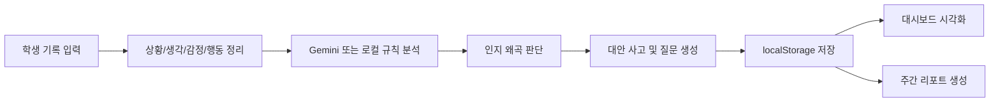

# CBT 기반 학습 불안 완화 AI 시스템 발표용 PPT 목차

> [!info]
> 이 문서는 `CBT 기반 학습 불안 완화 및 메타인지 강화 AI 시스템` 발표를 위해 바로 PPT로 옮길 수 있도록 구성한 슬라이드 목차 문서이다.  
> 발표 대상은 학생, 교사, 심사자 모두를 고려했고, `문제 정의 → 설계 → 구현 → 결과 → 기대 효과` 흐름으로 구성했다.

---

## 발표 전체 구성

- 권장 발표 시간: 7분 ~ 10분
- 권장 슬라이드 수: 10장 ~ 12장
- 발표 핵심: `왜 만들었는가`, `어떻게 구현했는가`, `무엇을 보여주는가`

---

## 슬라이드 1. 표지

### 제목

인지행동치료 기반의 학습 불안 완화와 메타인지 강화 AI 시스템

### 부제

학습 상황 기록, 인지 왜곡 분석, 감정 시각화를 결합한 자기점검 웹앱

### 넣을 내용

- 프로젝트명
- 발표자 이름
- 소속 또는 팀명
- 발표 날짜

### 발표 멘트

안녕하세요. 저희는 학습 불안을 겪는 학생들이 자신의 생각 패턴을 기록하고, AI와 데이터 시각화를 통해 스스로를 점검할 수 있도록 돕는 CBT 기반 웹 시스템을 개발했습니다.

---

## 슬라이드 2. 문제 인식

### 제목

왜 이 프로젝트가 필요했는가

### 핵심 메시지

- 같은 시험 결과를 겪어도 학생마다 감정과 행동이 다르게 나타난다.
- 중요한 것은 사건 자체보다 그 사건을 해석하는 생각이다.
- 하지만 학생이 혼자 CBT 기록을 실천하기는 어렵다.

### 넣을 내용

- 학습 불안 사례 1개
- 시험 실패 후 떠오르는 자동 사고 예시
- CBT의 ABC 모델 간단 도식

### 발표 멘트

예를 들어 시험 점수가 기대보다 낮게 나왔을 때 어떤 학생은 복습 계획을 세우지만, 어떤 학생은 나는 원래 안 되는 사람이라고 생각하며 회피하게 됩니다. 이 차이를 만드는 핵심은 사건보다 생각이며, 저희는 이 점에 주목했습니다.

---

## 슬라이드 3. 이론적 배경

### 제목

CBT와 인지 왜곡 개념

### 핵심 메시지

- CBT는 사건(A), 신념(B), 결과(C)의 연결 구조를 본다.
- 왜곡된 생각을 발견하고 수정하는 과정이 정서 완화에 도움을 준다.
- 본 프로젝트는 이 과정을 학생용 웹 도구로 구현했다.

### 넣을 내용

- ABC 모델
- 7가지 인지 왜곡 키워드
  - 흑백논리
  - 과잉일반화
  - 파국화
  - 개인화
  - 긍정 무시
  - 독심술
  - 당위 진술

### 발표 멘트

CBT에서는 사건 자체가 감정을 만드는 것이 아니라, 그 사건을 어떻게 해석하느냐가 감정과 행동을 결정한다고 봅니다. 그래서 이 프로젝트는 학생이 자신의 자동 사고를 기록하고, 왜곡 패턴을 확인하도록 설계했습니다.

---

## 슬라이드 4. 프로젝트 목표

### 제목

프로젝트 목표

### 핵심 메시지

- 학생이 스스로 왜곡된 생각 패턴을 발견하도록 돕는다.
- 생각, 감정, 행동의 연결을 데이터로 시각화한다.
- 생성형 AI를 활용해 분석과 대안 사고 제안을 자동화한다.

### 넣을 내용

- 목표 3가지 카드형 정리
- 기록, 분석, 시각화 키워드

### 발표 멘트

이 프로젝트의 핵심 목표는 단순한 상담 챗봇이 아니라, 학생이 자기 생각을 구조화해서 보고, AI의 도움을 받아 다시 해석하고, 누적 데이터를 시각적으로 확인하도록 만드는 것입니다.

---

## 슬라이드 5. 개발 계획과 일정

### 제목

개발 일정과 단계별 진행

### 핵심 메시지

- 이론 조사
- 시스템 설계
- 핵심 기능 개발
- AI 연동 및 데이터 수집
- 데이터 시각화
- 결과 정리

### 넣을 내용

- 제공된 일정표 스크린샷 요약
- 3단계 개발 계획
  - 1단계: 입력 화면 + AI 연동
  - 2단계: 저장 + 시각화
  - 3단계: 주간 리포트 + 다듬기

### 발표 멘트

먼저 CBT 이론과 인지 왜곡을 조사한 뒤, 입력 화면과 데이터 구조를 설계했습니다. 이후 핵심 입력 기능과 AI 분석 기능을 구현하고, 마지막으로 차트와 주간 리포트를 통해 결과를 정리했습니다.

---

## 슬라이드 6. 시스템 구조

### 제목

작품이 동작하는 전체 구조

### 핵심 메시지

- 입력
- 분석
- 저장
- 시각화
- 리포트

### 넣을 내용

- 아래 흐름도를 그대로 사용 가능

### 발표 멘트

이 시스템은 먼저 학생의 기록을 받고, 분석 엔진이 왜곡 패턴을 판단한 뒤, 그 결과를 저장하고 차트와 리포트로 다시 보여주는 구조로 설계했습니다.

---

## 슬라이드 7. 핵심 기능 1: 기록 입력

### 제목

폼 입력과 대화형 입력

### 핵심 메시지

- 두 가지 입력 방식 제공
- 초보자는 대화형, 익숙한 사용자는 폼 입력 사용 가능
- 최종적으로는 같은 기록 데이터 구조로 저장

### 넣을 내용

- 입력 화면 캡처
- 4단계 기록 흐름
  - 상황
  - 생각
  - 감정 및 강도
  - 행동

### 발표 멘트

기록 방식은 두 가지입니다. 하나는 화면의 칸을 채우는 폼 방식이고, 다른 하나는 AI와 대화하듯 입력하는 채팅 방식입니다. 둘 다 최종적으로는 하나의 동일한 데이터 구조로 정리되어 저장됩니다.

---

## 슬라이드 8. 핵심 기능 2: AI 분석

### 제목

Gemini 기반 인지 왜곡 분석

### 핵심 메시지

- 입력된 생각을 바탕으로 왜곡 패턴을 분석
- 설명, 질문, 대안적 사고까지 생성
- API 실패 시 로컬 규칙 기반 폴백 제공

### 넣을 내용

- 분석 결과 모달 화면 캡처
- 분석 결과 항목
  - 왜곡 유형
  - 판단 근거
  - 다시 생각해볼 질문
  - 대안적 사고
  - 오늘의 행동

### 발표 멘트

AI는 단순히 감정을 위로하는 역할이 아니라, 입력된 생각이 어떤 왜곡 패턴에 가까운지 분석하고, 학생이 다시 생각해볼 수 있도록 질문과 대안적 사고를 제시합니다. 또한 API 오류가 나더라도 앱이 멈추지 않도록 로컬 규칙 분석을 함께 설계했습니다.

---

## 슬라이드 9. 핵심 기능 3: 데이터 저장과 시각화

### 제목

기록을 데이터로 보여주는 대시보드

### 핵심 메시지

- 누적 기록이 있어야 자기 패턴을 볼 수 있다.
- 감정 변화와 왜곡 패턴을 차트로 확인할 수 있다.
- 요일과 시간대별 불안 패턴까지 볼 수 있다.

### 넣을 내용

- 선 그래프: 감정 강도 변화
- 도넛 차트: 왜곡 패턴 빈도
- 히트맵: 요일/시간대별 강도

### 발표 멘트

기록이 쌓이면 단순한 일기에서 끝나는 것이 아니라, 내가 언제 불안이 높아지는지, 어떤 왜곡 패턴이 자주 나오는지 한눈에 볼 수 있습니다. 이것이 메타인지 향상에 중요한 이유입니다.

---

## 슬라이드 10. 핵심 기능 4: 주간 리포트

### 제목

최근 7일 기록 기반 주간 리포트

### 핵심 메시지

- 최근 7일 기록을 요약
- 감정 흐름과 반복 패턴 정리
- 다음 주 실천할 생각 연습 제안

### 넣을 내용

- 주간 리포트 화면 캡처
- 로컬 리포트와 Gemini 리포트 차이 간단 비교

### 발표 멘트

개별 기록이 한 번의 자기점검이라면, 주간 리포트는 반복되는 패턴을 정리하는 기능입니다. 학생은 이번 주 어떤 감정을 자주 느꼈는지, 어떤 왜곡이 반복됐는지, 다음 주에는 어떤 방식으로 생각을 점검할지 확인할 수 있습니다.

---

## 슬라이드 11. 기대 효과와 수행 결과

### 제목

예상 결과와 기대 효과

### 핵심 메시지

- 학습 불안을 스스로 기록하고 해석하는 습관 형성
- 왜곡된 사고 패턴의 반복을 데이터로 확인
- 메타인지 향상과 자기조절 학습에 도움

### 넣을 내용

- 수행 결과
  - 실제 동작하는 웹앱 구현
  - AI 분석 기능 구현
  - 시각화 및 주간 리포트 구현
- 기대 효과
  - 자기점검 습관 형성
  - 사고 재구성 훈련
  - 심리학과 AI 융합 학습 경험

### 발표 멘트

이 프로젝트를 통해 학생은 자신의 불안을 막연한 감정으로 두는 것이 아니라 기록 가능한 데이터로 바꾸고, 반복되는 생각 패턴을 파악해 스스로 조절하는 연습을 할 수 있습니다.

---

## 슬라이드 12. 결론

### 제목

결론 및 마무리

### 핵심 메시지

- CBT 이론을 웹 시스템으로 구현했다.
- AI는 분석 보조 도구로 사용했다.
- 최종 목표는 학생의 자기이해와 메타인지 향상이다.

### 넣을 내용

- 한 줄 결론
- 향후 확장 가능성
  - 사용자 계정 기능
  - 서버 동기화
  - 장기 리포트
  - 상담 교사용 대시보드

### 발표 멘트

정리하면, 이 프로젝트는 CBT 이론을 바탕으로 학생이 자신의 생각, 감정, 행동을 기록하고, AI와 시각화를 활용해 자기 패턴을 이해하도록 돕는 웹 시스템입니다. 앞으로는 계정 기능과 서버 동기화, 장기 분석 기능으로 확장할 수 있습니다.

---

## 발표용 추천 스토리라인

발표는 아래 순서로 하면 가장 자연스럽다.

1. 학습 불안이라는 문제 제기
2. CBT라는 이론적 해결 틀 제시
3. 이를 웹앱으로 구현한 목적 설명
4. 실제 기능 시연
5. 데이터 시각화와 리포트 의미 설명
6. 기대 효과와 확장 가능성으로 마무리

---

## 시연용 추천 순서

발표 도중 실제 사이트를 보여준다면 아래 순서가 좋다.

1. 메인 랜딩 화면 소개
2. 폼 입력 또는 대화형 입력으로 예시 1건 기록
3. 분석 결과 모달 확인
4. 대시보드 차트 확인
5. 주간 리포트 확인
6. 백업 내보내기 기능 간단 설명

---

## 발표자 체크리스트

- 프로젝트 목표를 1문장으로 말할 수 있는가
- CBT의 ABC 모델을 짧게 설명할 수 있는가
- 왜 AI만 쓰지 않고 로컬 폴백도 넣었는지 설명할 수 있는가
- 차트가 왜 필요한지 말할 수 있는가
- 기대 효과가 기술적 결과와 교육적 의미 모두 포함되는가

---

## 마지막 한 문장 예시

> 이 작품은 학생이 학습 불안을 겪는 순간의 생각을 기록하고,  
> AI와 시각화를 통해 왜곡된 사고 패턴을 스스로 발견하도록 돕는  
> CBT 기반 메타인지 훈련 시스템입니다.

